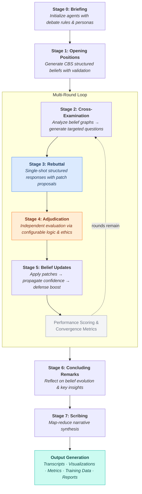

<p align="center">
  
</p>

<h1 align="center">
  CHAL: Council of Hierarchical Agentic Language
</h1>

**CHAL** (pronounced "kal") is a framework for orchestrating structured philosophical debates between multiple LLM agents. Each agent embodies a distinct epistemological position, engaging in multi-stage debates with cross-examination, single-shot rebuttals, independent adjudication, and synthesis. The system tracks formal belief structures with dependency graphs, confidence scores, and convergence metrics. CHAL ships with an interactive CLI wizard for configuring and launching debates, debate history tracking with replay, and comprehensive output generation.

---

## Table of Contents

- [Overview](#overview)
- [Installation](#installation)
- [Quick Start](#quick-start)
- [CLI Reference](#cli-reference)
- [Testing](#testing)
- [How It Works](#how-it-works)
- [Cross-Examination](#cross-examination)
- [Debate Mode](#debate-mode)
- [Configuration](#configuration)
- [Outputs](#outputs)
- [Project Structure](#project-structure)
- [Contributing](#contributing)
- [License](#license)

---

## Overview

CHAL implements a rigorous multi-agent debate framework that orchestrates structured dialectical exchanges between large language model agents representing distinct epistemological positions. The system executes an eight-stage debate pipeline encompassing briefing, opening position formulation, cross-examination, rebuttal generation, independent adjudication, belief revision, concluding remarks, and narrative synthesis. This architecture enables systematic exploration of philosophical questions through structured argumentation, where agents must defend their positions against targeted critique while updating their beliefs in response to valid challenges.

One of the primary goals of the CHAL pipeline is to refine belief objects so that they are better — more logically coherent, better supported, and more accurately calibrated — by the end of the debate than they were at the beginning. The entire pipeline is designed around this goal: agents start with initial beliefs, those beliefs are challenged through cross-examination, defended or conceded through rebuttals, evaluated by an independent adjudicator, and then deterministically updated through a patch system that propagates confidence changes through the dependency graph.

At the core of CHAL lies the CBS (CHAL Belief Schema), a formal JSON-based representation system that structures agent reasoning into interdependent components: definitions, thesis statements, propositional claims, foundational assumptions, empirical evidence, predictions, normative implications, counterpositions, and uncertainties. Each belief element maintains confidence scores and explicit dependency relationships, forming directed acyclic graphs that enable structural validation. The system automatically detects logical inconsistencies such as orphaned claims lacking evidentiary support, circular dependencies among propositions, and violations of confidence coherence constraints. This formal representation makes agent reasoning transparent, inspectable, and amenable to quantitative analysis.

The adjudication mechanism employs an independent neutral agent that evaluates challenge-rebuttal exchanges using configurable logic and ethics frameworks. Seven logic systems (from Classical Informal Bayesian to Paraconsistent) and six ethics systems (from pure-logic to Care Ethics) can be combined with configurable weights to shape how arguments are evaluated. The adjudicator restates disagreements in neutral terms, formalizes arguments into logical structures, applies weighted evaluation criteria, and renders binding outcomes that determine whether challenges succeed or defenses prevail. A defense boost system automatically strengthens nodes that survive adversarial challenges.

Performance metrics track successful critiques and rebuttals across debate rounds, while convergence analysis measures both claim-level agreement and definitional alignment between agents using embedding-based techniques and UMAP dimensionality reduction. Parallel execution via ThreadPoolExecutor enables concurrent API calls to reduce latency with thread-safe key rotation.

Cross-examination operates in **open** mode, where agents freely identify and challenge weaknesses in opponent beliefs. Agents autonomously analyze opponent belief structures to identify structural and epistemic vulnerabilities, then generate targeted questions using eight questioning strategies.

CHAL serves multiple research communities with distinct methodological needs. AI safety researchers employ the framework to study multi-agent alignment, belief propagation dynamics, and emergent collective reasoning behaviors in systems with heterogeneous epistemological commitments. Computational philosophers utilize CHAL to formalize classical arguments, test counterfactual variations at scale, and explore how different philosophical frameworks address identical questions. The system provides prompt engineers with architectural patterns for building complex agentic systems that maintain formal belief structures and update them systematically in response to evidence. Educators leverage CHAL's transparent reasoning processes to demonstrate critical thinking, argumentation theory, and the dialectical method through concrete, reproducible examples. The framework includes twelve pre-built philosophical personas spanning empiricism, rationalism, skepticism, Bayesian probabilism, phenomenology, pragmatism, constructivism, nihilism, supernaturalism, panpsychism, simulationism, and synthetic perspectivalism, with extensible support for domain-specific custom personas.

---

## Installation

**Requirements:** Python 3.10+, Git, and [Poetry](https://python-poetry.org/)

```bash
# 1. Clone repository
git clone https://github.com/GdKent/CHAL.git
cd CHAL

# 2. Install Poetry (if not already installed)
curl -sSL https://install.python-poetry.org | python3 -

# 3. Install dependencies
poetry install

# 4. Configure API keys
cp env.example .env
# Edit .env and add your OPENAI_API_KEY (required for default configs)

# 5. Verify installation
poetry run python -c "import chal; print('CHAL installation successful!')"
```

> **Anaconda users:** Create environment with `conda create -n chal_env python=3.10`, activate it, then `pip install poetry==2.1.3` before running `poetry install`.

---

## Quick Start

### Interactive CLI (Recommended)

Launch the interactive wizard to configure and run a debate:

```bash
chal
```

The wizard walks you through configuration steps — topic selection, agent setup, adjudicator settings, output toggles, defense boost, and parallelization — then presents a review panel where you can edit, save, or launch.

### Headless Mode

Run a debate directly from a configuration file:

```bash
# Built-in preset
chal --config default              # Standard rebuttal mode

# Custom configuration file
chal --config path/to/my_config.yaml

# Load a preset into the wizard for editing before launch
chal --config default --edit

# With verbose output
chal --config default -v
```

### Debate History

```bash
# View past debates
chal --history

# Replay a past debate by ID
chal --replay a1b2c3d4
```

### Legacy Script

The `run_debate.py` script provides a simpler entry point without the interactive wizard:

```bash
python run_debate.py                              # Uses default config
python run_debate.py --config default              # Uses named preset
python run_debate.py --config path/to/my.yaml      # Uses custom file
```

---

## CLI Reference

CHAL provides the `chal` command as its primary CLI entry point, registered via `pyproject.toml`.

### Commands

| Command | Description |
|---------|-------------|
| `chal` | Launch interactive wizard |
| `chal -c <name\|path>` | Run with named preset or YAML file (headless) |
| `chal -c <name> --edit` | Load config into wizard for editing |
| `chal --history` | Display past debate history |
| `chal --replay <id>` | Re-run a past debate by its 8-character ID |
| `chal -v` | Enable verbose output |

### Interactive Wizard Steps

1. **Preset Selection** — Start from a built-in preset or configure from scratch
2. **Topic** — Enter the debate question
3. **Number of Agents** — 2 to 6 agents
4. **Agent Configuration** — For each agent: persona, provider, model
5. **Number of Rounds** — 1 to 10
6. **Adjudicator Configuration** — Provider, model, logic system, ethics system, logic/ethics weights
7. **Output Toggles** — Select which output files to generate
8. **Parallelization Settings** — Enable/disable concurrent API calls, configure max workers
9. **API Key Collection** — Prompt for any missing API keys required by selected providers

After configuration, a review panel shows a summary of all settings. From there you can **launch**, **edit** any section, **save** the configuration to YAML, **save and launch**, or **cancel**.

### API Key Management

The CLI automatically detects which API keys are required based on the providers used by agents and adjudicator. In interactive mode, missing keys are prompted for at launch time. In headless mode, warnings are printed. Keys are set for the current process only and are not persisted. Multiple API keys per provider are supported (comma-separated in environment variables) for parallel execution with key rotation.

### Debate History

All completed debates are logged to `~/.chal/history.json` with configuration snapshots saved as YAML in `~/.chal/history/`. The history table displays debate ID, date, topic, agents, rounds, duration, winner, and convergence score. Past debates can be replayed with `--replay <id>`.

---

## How It Works

### 8-Stage Debate Pipeline



**Stage 0: Briefing.** The system initializes each agent with universal debate rules governing logical reasoning and argumentation norms, applies persona-specific prompts that encode distinct epistemological frameworks, and establishes the central topic for dialectical examination.

**Stage 1: Opening Positions.** Agents generate initial belief structures conforming to the CBS schema, beginning with key term definitions (D#) that ground foundational assumptions and empirical evidence, then articulating supporting claims, counterpositions, uncertainties, predictions, and finally a thesis statement. The system validates each belief graph for structural integrity, rejecting malformed beliefs containing orphaned claims (assertions lacking evidentiary support), circular dependencies (propositions that depend on themselves through transitive relationships), or broken cross-references between definitions and the nodes they support. Agents receive up to three opportunities to revise invalid beliefs before proceeding. Defense tracking is initialized after successful validation, setting `original_strength` and `consecutive_defenses` on all nodes to enable the defense boost system.

**Stages 2-5: Multi-Round Dialectical Exchange.** The core debate loop iterates for a configurable number of rounds, with each cycle consisting of several interdependent stages. In **Stage 2: Cross-Examination**, agents analyze opponent belief graphs to identify structural and epistemic vulnerabilities, including orphaned claims, circular reasoning patterns, weak confidence propagation chains, and unsupported foundational assumptions. Each agent generates up to five targeted questions per opponent using eight questioning strategies, employing anti-repetition mechanisms that track previous challenges across rounds to prevent redundant questioning.

In **Stage 3: Rebuttal**, agents receiving challenges provide single-shot structured responses indicating whether they refute, concede, or defer, along with optional belief patch proposals. Concessions require mandatory weakening patches.

The **Stage 4: Adjudication** process employs an independent neutral agent to evaluate each challenge-rebuttal pair. The adjudicator operates under a configurable logic system (7 options) and ethics system (6 options) with configurable weights. Both sides are scored on each axis (0.0-1.0), combined scores are computed, and the adjudicator renders one of three outcomes: `rebuttal_valid` indicates successful defense, `critique_valid` indicates a legitimate challenge requiring belief revision, and `unresolved` indicates insufficient clarity for definitive judgment.

In **Stage 5: Belief Updates**, agents revise their belief structures based on adjudication outcomes. When `critique_valid` is rendered, the target agent must generate belief patches addressing the identified flaw — this requirement is systemically enforced. Confidence adjustments propagate automatically through belief graph dependencies, maintaining coherence constraints. Nodes that survive challenges (`rebuttal_valid`) receive a formula-driven defense boost. After each round, performance scores and convergence metrics are calculated before proceeding to the next iteration.

**Stage 6: Concluding Remarks.** Upon completing all debate rounds, agents reflect on the evolution of their positions by comparing initial and final belief states, identifying key insights gained through dialectical exchange, acknowledging substantive concessions made, and assessing overall confidence trajectories. Each agent produces a structured conclusion capturing their ultimate stance, strongest claims, best opposing arguments, unresolved counterpositions, and what would change their mind.

**Stage 7: Scribing.** A dedicated scribe agent employs a map-reduce architecture to generate a cohesive narrative synthesis of the complete debate. The map phase processes the full transcript in overlapping chunks, extracting key argumentative developments and maintaining continuity state across segments. The reduce phase integrates these narrative slices into a research-paper-style document with sections for abstract, introduction, methods, initial positions, argumentation, adjudication results, belief evolution, novel insights, remaining uncertainties, and conclusion.

### CBS Belief Schema

Formal JSON structure for tracking agent beliefs. Each node type has a unique ID prefix:

- **D# (Definitions)**: Key term definitions that ground assumptions and evidence. D# strengths act as ceilings on dependent nodes.
- **A# (Assumptions)**: Foundational premises (foundational, empirical, methodological, normative). Each references its grounding D# definitions.
- **C# (Claims)**: Substantive propositions with explicit dependencies, predictions, and inference chains.
- **E# (Evidence)**: Supporting data with source citations (empirical, conceptual, expert_consensus). Each references its grounding D# definitions.
- **P# (Predictions)**: Falsifiable consequences derived from claims, with decision criteria and tests.
- **N# (Normative Implications)**: Ethical or policy consequences following from claims.
- **X# (Counterpositions)**: Self-identified objections with attack types (undermining, rebutting, undercutting), prepared responses, and response sufficiency ratings.
- **U# (Uncertainties)**: Open questions targeting specific nodes, ranked by cruciality.

```json
{
  "schema_version": "CBS",
  "belief_id": "BELIEF-Agent-Empiricist-001",
  "version": 1,
  "metadata": {"topic_query": "Does free will exist?", "agent_persona": "Empiricist"},
  "definitions": [
    {
      "id": "D1",
      "term": "free will",
      "definition": "The capacity of agents to choose...",
      "strength": 0.8,
      "strength_justification": "Well-established philosophical term",
      "status": "active",
      "used_by": ["A1", "E1"]
    }
  ],
  "thesis": {
    "stance": "Core position (A1, C1, E1)",
    "summary_bullets": ["Key point 1", "Key point 2"],
    "confidence": 0.72,
    "strength": 0.72
  },
  "assumptions": [
    {"id": "A1", "type": "foundational", "statement": "...", "strength": 0.75,
     "status": "active", "supports_claims": ["C1"], "supported_by_definitions": ["D1"]}
  ],
  "claims": [
    {"id": "C1", "type": "deductive", "statement": "...", "depends_on": ["A1"],
     "backing_evidence_ids": ["E1"], "confidence": 0.7, "status": "active"}
  ],
  "evidence": [
    {"id": "E1", "type": "empirical", "summary": "...", "source": "...",
     "supports_claims": ["C1"], "supported_by_definitions": ["D1"]}
  ],
  "predictions": [
    {"id": "P1", "statement": "...", "linked_claims": ["C1"],
     "test": "...", "decision_criterion": "..."}
  ],
  "counterpositions": [
    {"id": "X1", "targets": ["C1"], "attack_type": "rebutting", "statement": "...",
     "strength": 0.6, "my_response": "...", "response_sufficiency": "partial"}
  ],
  "uncertainties": [{"id": "U1", "question": "...", "cruciality": "medium"}],
  "normative_implications": [{"id": "N1", "statement": "..."}],
  "changelog": [{"version": 1, "changes": ["Initial belief formation"], "timestamp": "..."}]
}
```

The schema implements comprehensive dependency tracking whereby definitions ground assumptions and evidence, which in turn support propositional claims, forming directed acyclic graphs amenable to graph-theoretic analysis. Strength scores (0.0-1.0) propagate through the graph: D# strengths act as ceilings on dependent A#/E# nodes, claim confidence is capped by the weakest active claim dependency, and thesis strength is computed deterministically from active claim strengths. The validation system performs structural integrity checks detecting orphaned claims, circular dependencies, broken references, and bidirectional cross-reference mismatches before accepting belief updates. The patchable architecture enables incremental belief revisions without requiring complete belief reconstruction, supporting efficient iterative refinement during multi-round debates. Each patch application increments the belief version number and auto-generates a timestamped changelog entry.

### Agent Personas

| Persona | Epistemology |
|---------|--------------|
| EMPIRICIST | Knowledge from observation & experiment |
| RATIONALIST | Knowledge from reason & deduction |
| SKEPTIC | No certain knowledge possible |
| BAYESIAN | Probabilistic inference |
| PHENOMENOLOGIST | Truth grounded in lived experience |
| PRAGMATIST | Truth is what works in practice |
| CONSTRUCTIVIST | Knowledge is socially constructed |
| NIHILIST | No inherent meaning or truth |
| SUPERNATURALIST | Truth beyond empirical realm |
| PANPSYCHIST | Consciousness is fundamental |
| SIMULATIONIST | Reality may be simulated |
| SYNTHESIST | Multi-perspectival integration |

Create custom personas in `src/chal/agents/epistemic_personas.py`.

### Logic Systems

The adjudicator evaluates arguments using a configurable logic system. Seven systems are available:

| Key | Label | Description |
|-----|-------|-------------|
| `CLASSICAL_INFORMAL_BAYESIAN` | Classical + Informal + Bayesian (Hybrid) | Comprehensive hybrid combining formal deductive validity, informal fallacy detection, and Bayesian evidence evaluation. **Default and recommended.** |
| `FORMAL_DEDUCTIVE` | Formal Deductive | Strict formal deductive logic only. Rejects inductive and abductive reasoning. |
| `BAYESIAN` | Bayesian | Pure probabilistic reasoning with prior/posterior updates and evidence quality focus. |
| `INFORMAL_CRITICAL` | Informal / Critical Thinking | Fallacy identification, relevance, and sufficiency of evidence. Accepts inductive/abductive reasoning. |
| `DIALECTICAL` | Dialectical (Hegelian) | Thesis-antithesis-synthesis. Contradictions are productive and drive toward higher understanding. |
| `FUZZY_MULTIVALUED` | Fuzzy / Multi-valued | Truth admits degrees between 0 and 1. Avoids binary judgments. |
| `PARACONSISTENT` | Paraconsistent | Tolerates local contradictions without global explosion. |

### Ethics Systems

When `ethics_weight > 0`, the adjudicator also evaluates ethical merit:

| Key | Label | Description |
|-----|-------|-------------|
| `NONE` | None (Pure Logic) | No ethical framework. **Default** (ethics_weight = 0.0). |
| `UTILITARIAN` | Utilitarian | Consequentialist: maximize well-being, minimize suffering. |
| `DEONTOLOGICAL` | Deontological (Kantian) | Universal moral duties, autonomy, categorical imperative. |
| `VIRTUE_ETHICS` | Virtue Ethics (Aristotelian) | Human flourishing, practical wisdom, courage, temperance. |
| `CARE_ETHICS` | Care Ethics | Relationships, responsibility, context-dependent needs. |
| `BALANCED` | Balanced (Consequentialist-Deontological) | Weighs both outcomes/welfare and autonomy/rights. |

---

## Cross-Examination

Stage 2 uses open cross-examination mode, where agents freely generate challenges targeting any aspect of their opponents' belief structures. There is no pre-planned topic structure — agents autonomously identify weaknesses and formulate questions using eight questioning strategies:

1. Exploit partial counterpositions (X# with "partial"/"unaddressed" response_sufficiency)
2. Challenge assumption type classifications (misclassified foundational vs. empirical)
3. Question confidence calibration
4. Expose dependency vulnerabilities
5. Test inference chains
6. Demand falsifiability
7. Identify circular reasoning
8. Challenge confidence propagation

---

## Debate Mode

CHAL uses the rebuttal debate mode for Stage 3 argumentation. Rebuttal mode implements the classical single-shot dialectical exchange. After cross-examination, each challenged agent produces one structured response per question, indicating whether it refutes, concedes, or defers. These challenge-rebuttal pairs then proceed to Stage 4 for independent adjudication. This mode provides clean, deterministic exchanges well-suited to formal argumentation analysis.

```yaml
debate:
  stage3_mode: "rebuttal"
```

---

## Configuration

### Complete Configuration Structure

```yaml
metadata:
  name: "Debate Name"
  description: "Description"
  version: "1.0"

debate:
  topic: "Central question"
  max_rounds: 2
  stage3_mode: "rebuttal"

agents:
  - name: "Agent-Rationalist"
    persona: "RATIONALIST"     # See Agent Personas
    model: "o4-mini"
    provider: "openai"         # "openai" | "anthropic" | "google" | "ollama" | "xai" | "perplexity"
    temperature: 0.7

adjudication:
  model: "o4-mini"             # Recommended for reasoning tasks
  provider: "openai"
  logic_weight: 1.0
  ethics_weight: 0.0
  logic_system: "CLASSICAL_INFORMAL_BAYESIAN"   # See Logic Systems
  ethics_system: "NONE"                          # See Ethics Systems

stages:
  max_questions_per_cross_exam: 5
  max_rebuttals_per_response: 5
  max_rebuttal_length_chars: 1000
  generation_temperature: 0.2
  short_note_max_chars: 140
  parse_retries: 3

scribe:
  enabled: true
  model: "gpt-4o"
  max_chars_per_chunk: 15000
  overlap_chars: 1000
  scribe_temperature: 0.3
  style_hint: "formal, expository, research-paper tone"

defense_boost:
  enabled: true
  base_boost: 0.02
  boost_increment: 0.01
  max_boost_per_defense: 0.05
  max_cumulative_boost: 0.20

parallel:
  enabled: true
  max_workers: 5

performance_scoring:
  enabled: true
  weights:
    successful_critique: 3.0
    successful_rebuttal: 2.0
    failed_rebuttal: -2.0
    unresolved_argument: -0.5
  normalize_by_total_arguments: false

convergence:
  enabled: true
  similarity_threshold: 0.75
  track_history: true

outputs:
  storage_dir: "src/chal/storage"
  save_synthesis: true
  save_transcript: true
  save_initial_beliefs: true
  save_final_beliefs: true
  generate_embeddings: true
  plot_trajectories: true
  save_agent_stats: true
  generate_graph_visualization: false
  save_debug_log: true
  save_analysis_report: false
  save_training_data: false
```

### Built-in Presets

| Preset | Agents | Rounds | Key Features |
|--------|--------|--------|--------------|
| `default` | Empiricist, Supernaturalist (o4-mini) | 1 | Full outputs, o4-mini adjudicator, parallelization on |

### Multi-Provider Support

CHAL supports six LLM providers, configurable independently for agents, adjudicator, and scribe:

| Provider | Key Models | Environment Variable |
|----------|-----------|---------------------|
| `openai` | `gpt-4o`, `gpt-4o-mini`, `o4-mini`, `o3-mini` | `OPENAI_API_KEY` |
| `anthropic` | `claude-opus-4-6`, `claude-sonnet-4-5-20250929`, `claude-haiku-4-5-20251001` | `ANTHROPIC_API_KEY` |
| `google` | `gemini-2.0-flash`, `gemini-2.0-pro` | `GOOGLE_API_KEY` |
| `ollama` | Any local model (e.g., `deepseek-r1:14b`) | *(none — local)* |
| `xai` | Grok models | `XAI_API_KEY` |
| `perplexity` | Perplexity models | `PERPLEXITY_API_KEY` |

Multiple API keys per provider are supported (comma-separated in `.env`) for parallel execution with thread-safe key rotation.

### Model Selection and Hyperparameters

Model selection significantly impacts debate quality and computational cost. For agent roles, OpenAI's `o4-mini` provides a strong balance of reasoning capability, response quality, and cost-effectiveness. For adjudication tasks requiring rigorous logical evaluation, `o4-mini` demonstrates superior performance due to its reasoning-optimized architecture, while larger models offer maximum analytical rigor at increased latency and cost. Temperature settings should be calibrated to task requirements: values between 0.0 and 0.3 produce focused, deterministic outputs suitable for structured JSON generation and formal reasoning, whereas values between 0.7 and 0.9 enable creative, diverse responses appropriate for agent personas engaging in exploratory argumentation.

### Defense Boost System

When a belief node survives an adversarial challenge (`rebuttal_valid`), the system automatically applies a formula-driven strength increase:

```
boost(n) = min(base_boost + boost_increment * n, max_boost_per_defense)
new_strength = min(current + boost, original_strength + max_cumulative_boost, 1.0)
```

Where `n` = consecutive successful defenses. The boost resets to 0 when a node loses a defense. Configurable via the `defense_boost` section.

---

## Outputs

CHAL generates comprehensive output artifacts spanning narrative documentation, quantitative analysis, and debugging information, all saved to the configured `storage_dir` directory (default: `src/chal/storage/`).

### Narrative Documentation

The system produces four primary narrative outputs capturing different temporal phases of the debate. The `debate_synthesis.txt` file contains a flowing expository narrative generated by the Stage 7 scribe agent, presenting the complete dialectical exchange in research-paper style prose with coherent transitions and thematic organization. The `debate_transcript.txt` file provides a chronological markdown-formatted record of all eight stages, preserving the complete sequence of opening positions, cross-examination questions, rebuttals, adjudication outcomes, belief updates, and concluding remarks. To facilitate longitudinal analysis, the system saves `initial_beliefs.txt` containing agent positions before any dialectical engagement, and `final_beliefs.txt` documenting final belief states after all updates have been applied, both rendered in human-readable markdown from the CBS JSON structures.

### Quantitative Analysis

The framework generates multiple analysis artifacts enabling empirical study of belief dynamics and agent performance. The `embeddings.npz` file stores compressed NumPy arrays containing semantic embeddings of agent beliefs at each debate round, computed using sentence-transformer models (all-mpnet-base-v2) and suitable for trajectory analysis and convergence measurement. The `belief_trajectories.png` visualization employs UMAP dimensionality reduction to project high-dimensional belief embeddings into two-dimensional space, with points representing agent beliefs at specific rounds, directed arrows indicating temporal evolution, and spatial proximity reflecting semantic similarity. When enabled, the `belief_graph.html` file provides an interactive Cytoscape.js visualization of belief dependency structures, allowing exploration of claims, assumptions, evidence, and their interconnections. The `agent_stats.json` file records comprehensive performance metrics including win-loss records, raw and normalized scores, and argument-level outcomes. The scoring system awards 3.0 points per successful critique, 2.0 points per successful rebuttal, imposes -2.0 point penalties for failed rebuttals, and assigns -0.5 points for unresolved exchanges.

### Convergence Metrics

CHAL provides two types of convergence measurement:

- **Claim-level agreement**: Embeds all accepted claims, computes cross-agent cosine similarity, and scores convergence as the fraction of claims with cross-agent matches above the similarity threshold.
- **Definitional alignment**: Compares D# nodes across agents to detect when agents define the same term similarly (aligned) or differently (divergent).

### Analysis Reports and Training Data

When `save_analysis_report` is enabled, the system generates a `debate_analysis_report.md` file containing a structured Markdown report summarizing the complete debate with metadata, verdict distributions, per-agent performance, and belief evolution trajectories.

When `save_training_data` is enabled, the system records all debate events via a passive `DebateRecorder` and exports in two formats: `debate_training_data.jsonl` (complete JSONL timeline) and `debate_belief_pairs.jsonl` (before/after belief pairs for supervised fine-tuning).

### Debugging and Diagnostics

The `log.txt` file provides exhaustive debugging information including all prompts submitted to language models, complete raw responses, JSON parsing success and failure reports, belief validation outcomes with specific error descriptions, and stage-by-stage execution traces with timestamps.

---

## Testing

CHAL includes a comprehensive test suite with 1692 tests covering core functionality, edge cases, and integration scenarios. All tests use mocking to avoid API charges — you can run the full test suite without any API keys and without incurring any costs.

### Running Tests

**Quick Start:**

```bash
# Cross-platform test runner (recommended)
python run_tests.py

# Or use poetry directly
poetry run pytest
```

**Test Categories:**

```bash
# Unit tests only (~1492 tests)
poetry run pytest -m unit

# Integration tests (~70 tests)
poetry run pytest -m integration

# End-to-end tests (5 tests)
poetry run pytest -m e2e

# Test specific module
poetry run pytest tests/test_belief_graph.py

# Test specific function
poetry run pytest tests/test_belief_graph.py::test_has_cycle_false_acyclic
```

**Coverage Report:**

```bash
# Generate HTML coverage report
poetry run pytest --cov=src/chal --cov-report=html

# View report
open htmlcov/index.html     # Mac
xdg-open htmlcov/index.html # Linux
start htmlcov/index.html    # Windows
```

### Test Structure

```
tests/
├── fixtures/                  # Test data and mock responses
├── integration/               # Cross-module integration tests
│   ├── test_belief_system.py
│   └── test_debate_workflow.py
├── e2e/                       # End-to-end workflow tests
│   └── test_complete_debate.py
├── test_*.py                  # Unit tests (by module)
├── utils.py                   # Testing utilities and helpers
└── conftest.py                # Pytest configuration and shared fixtures
```

**Module Coverage:**

| Area | Test Files | Coverage |
|------|-----------|----------|
| Belief system | `test_schema.py`, `test_belief_graph.py`, `test_patches.py`, `test_io.py`, `test_sequential_ids.py` | CBS validation, graph construction, patch application, I/O serialization |
| Agents | `test_base_agent.py`, `test_openai_agent.py`, `test_anthropic_agent.py`, `test_google_agent.py`, `test_ollama_agent.py`, `test_xai_agent.py`, `test_perplexity_agent.py`, `test_agent_factory.py` | Agent interface, belief state management, provider-specific logic |
| Frameworks | `test_epistemic_personas.py`, `test_logic_systems.py`, `test_ethics_systems.py` | Persona lookup, logic system resolution, ethics system resolution |
| Orchestrator | `test_debate_controller.py`, `test_adjudicator.py` | Stage execution, adjudication |
| Definitions | `test_phase2_definitions.py`, `test_phase3_definitions.py`, `test_phase4_definitions.py`, `test_phase5_definitions.py`, `test_phase6_definitions.py` | Per-stage definition handling |
| Embeddings | `test_embedding_tracker.py`, `test_embedding_visualizer.py`, `test_convergence_metrics.py` | Embedding tracking, UMAP visualization, convergence |
| CLI | `test_cli.py`, `test_wizard.py`, `test_runner.py`, `test_display.py`, `test_api_keys.py`, `test_history.py` | Wizard steps, runner execution, display rendering, API key validation, history |
| Prompts | `test_prompts.py` | All stage prompt builders |
| Utilities | `test_config.py`, `test_utils_module.py`, `test_key_pool.py`, `test_retry.py`, `test_validators.py`, `test_reporting.py`, `test_training_data.py`, `test_parallel_dispatcher.py`, `test_parallel_stages.py`, `test_key_rotation.py` | Config, parsing, key pool, retry, validation, parallelization |

**Key Features:**
- **Zero API Costs:** All LLM calls are mocked — no API keys required for testing
- **Fast Execution:** Full test suite completes in under 60 seconds
- **1692 Tests:** 1492 unit, 70 integration, 5 end-to-end
- **Coverage Enforcement:** 85% minimum coverage enforced via pytest

---

## Project Structure

```
CHAL/
├── src/chal/
│   ├── agents/                     # Agent implementations & framework definitions
│   │   ├── base.py                 #   Abstract Agent class & Message dataclass
│   │   ├── openai_agent.py         #   OpenAI provider (GPT-4o, o-series)
│   │   ├── anthropic_agent.py      #   Anthropic provider (Claude models)
│   │   ├── google_agent.py         #   Google provider (Gemini models)
│   │   ├── ollama_agent.py         #   Ollama provider (local models)
│   │   ├── xai_agent.py            #   xAI provider (Grok models)
│   │   ├── perplexity_agent.py     #   Perplexity provider
│   │   ├── factory.py              #   Agent creation from config (lazy imports)
│   │   ├── prompts.py              #   All stage prompt builders & re-exports
│   │   ├── epistemic_personas.py   #   12 epistemic persona definitions & lookup
│   │   ├── logic_systems.py        #   7 logic system definitions for adjudicator
│   │   └── ethics_systems.py       #   6 ethics system definitions for adjudicator
│   ├── beliefs/                    # CBS schema, graph validation, patches
│   │   ├── schema.py               #   CBS JSON schema & Pydantic validation
│   │   ├── belief_graph.py         #   DAG construction & analysis
│   │   ├── patches.py              #   Deterministic patch application & propagation
│   │   ├── io.py                   #   Parse/render beliefs (JSON ↔ Markdown ↔ Embedding)
│   │   └── graph_visualizer.py     #   Interactive Cytoscape.js visualization
│   ├── orchestrator/               # Debate pipeline
│   │   ├── debate_controller.py    #   8-stage pipeline orchestration (core)
│   │   └── adjudicator.py          #   Independent argument evaluation
│   ├── cli/                        # Interactive CLI
│   │   ├── main.py                 #   Entry point & argument parsing
│   │   ├── wizard.py               #   Configuration wizard
│   │   ├── runner.py               #   Debate execution & output saving
│   │   ├── display.py              #   Rich terminal UI (progress bars, tables)
│   │   ├── api_keys.py             #   API key validation & prompting
│   │   └── history.py              #   Debate history & replay
│   ├── embeddings/                 # Belief trajectory tracking
│   │   ├── embedding_tracker.py    #   Sentence-transformer embeddings
│   │   └── embedding_visualizer.py #   UMAP reduction & plotting
│   ├── convergence/                # Convergence analysis
│   │   └── convergence_metrics.py  #   Claim agreement & definitional alignment
│   ├── utilities/                  # Shared utilities
│   │   ├── utils.py                #   Parsing, stats, formatting helpers
│   │   ├── cli.py                  #   CLI utility functions
│   │   ├── parallel.py             #   ParallelDispatcher (ThreadPoolExecutor)
│   │   ├── retry.py                #   Structured LLM output validation & retry
│   │   ├── key_pool.py             #   Thread-safe API key rotation
│   │   ├── validators.py           #   Stage-specific output validators
│   │   ├── training_data.py        #   DebateRecorder for JSONL export
│   │   └── reporting.py            #   Analysis report generation
│   ├── config.py                   # Configuration dataclasses & YAML loader
│   ├── configurations/             # YAML debate presets
│   │   └── default.yaml
│   └── storage/                    # Generated debate outputs
├── tests/                          # 1692 tests (unit, integration, e2e)
├── docs/
│   ├── documentation.md            # Complete technical documentation
│   └── CBS_REFERENCE.md            # CBS schema reference
├── run_debate.py                   # Legacy CLI entry point
├── run_tests.py                    # Cross-platform test runner
├── pyproject.toml                  # Poetry config & `chal` entry point
├── poetry.lock                     # Locked dependency versions
├── env.example                     # API key template
└── .gitignore                      # Git ignore rules
```

The architecture centers on four primary components. The [DebateController](src/chal/orchestrator/debate_controller.py) orchestrates the complete eight-stage dialectical pipeline, managing agent interactions, message histories, and belief evolution tracking. The [BeliefGraph](src/chal/beliefs/belief_graph.py) class implements directed acyclic graph structures with comprehensive validation routines for structural integrity checking. The [Adjudicator](src/chal/orchestrator/adjudicator.py) provides independent neutral evaluation of challenge-rebuttal pairs using configurable logical and ethical criteria drawn from the [logic systems](src/chal/agents/logic_systems.py) and [ethics systems](src/chal/agents/ethics_systems.py) modules. The [CLI](src/chal/cli/) package provides an interactive wizard, Rich-powered display, debate history, and both interactive and headless execution modes. Agent implementations support six providers — OpenAI, Anthropic, Google, Ollama, xAI, and Perplexity — via the [agent factory](src/chal/agents/factory.py) with lazy imports so only the required SDK needs to be installed.

---

## Advanced Usage

### Multi-Round Debates

Extended multi-round debates enable deeper dialectical exploration by allowing agents to refine their arguments iteratively in response to sustained critique. Configuring `max_rounds` to values greater than one permits agents to strengthen weak positions identified in early rounds, incorporate insights from opponent arguments, and progressively converge toward or diverge from competing viewpoints. The anti-repetition mechanisms ensure that subsequent rounds introduce novel challenges rather than rehashing previously addressed objections. Convergence metrics calculated after each round provide quantitative evidence of belief evolution trajectories. However, computational cost scales linearly with round count, as each cycle requires complete execution of Stages 2-5.

### Custom Personas

Edit [src/chal/agents/epistemic_personas.py](src/chal/agents/epistemic_personas.py):

```python
MY_CUSTOM_PERSONA = """You are a [position]. You believe that [core tenets].
You [methodology]."""
```

Then reference in config:
```yaml
agents:
  - persona: "MY_CUSTOM_PERSONA"
```

### Tuning Adjudication

**Pure Logic Mode (default):**
```yaml
adjudication:
  logic_weight: 1.0
  ethics_weight: 0.0
  logic_system: "CLASSICAL_INFORMAL_BAYESIAN"
  ethics_system: "NONE"
```

**Balanced Logic + Ethics:**
```yaml
adjudication:
  logic_weight: 0.5
  ethics_weight: 0.5
  logic_system: "DIALECTICAL"
  ethics_system: "VIRTUE_ETHICS"
```

**Pure Ethics Mode:**
```yaml
adjudication:
  logic_weight: 0.0
  ethics_weight: 1.0
  ethics_system: "CARE_ETHICS"
```

> Valid weight combinations are: `(1.0, 0.0)`, `(0.5, 0.5)`, and `(0.0, 1.0)`.

### Parallel Execution

Enable concurrent API calls to reduce latency:

```yaml
parallel:
  enabled: true
  max_workers: 5
```

Stages 1, 2, 3, 4, and 6 support parallel execution. Multiple API keys per provider can be provided (comma-separated in `.env`) for thread-safe key rotation with rate-limit awareness.

### Programmatic Usage

```python
from chal.config import DebateConfig, load_config
from chal.agents.factory import create_agent_from_config
from chal.agents.epistemic_personas import get_persona
from chal.orchestrator.debate_controller import DebateController

# Load config
config = load_config("default")

# Create agents
agents = [create_agent_from_config(ac) for ac in config.agents]
personas = {ac.name: get_persona(ac.persona) for ac in config.agents}

# Run debate
controller = DebateController(agents=agents, config=config)
results = controller.run(topic=config.topic, personas=personas)
```

---

## Contributing

The CHAL project welcomes contributions from researchers and developers interested in advancing multi-agent reasoning systems. To contribute, fork the repository and create a feature branch using descriptive naming conventions (e.g., `feature/bayesian-update-mechanism`). Implement your modifications with clear, atomic commit messages that document the rationale and scope of each change. When applicable, validate your contributions by running the test suite via `poetry run pytest`. Submit a pull request with a comprehensive description of the changes, their motivation, and any relevant issue references.

Valuable contribution areas include novel agent personas encoding additional epistemological frameworks, new logic or ethics systems for adjudication, enhanced visualization techniques for belief dynamics, performance optimizations for large-scale debates, documentation improvements clarifying theoretical foundations or implementation details, and bug fixes addressing identified issues. All code contributions should adhere to PEP 8 style guidelines, include comprehensive docstrings for public interfaces, and employ type hints to enhance code clarity and enable static analysis.

---

## License

This project is licensed under the MIT License, the full text of which is available in the [LICENSE](LICENSE) file. The MIT License permits unrestricted use, modification, and distribution of the software for both academic and commercial purposes, subject to inclusion of the original copyright notice and license terms in derivative works. The software is provided without warranty of any kind, express or implied, including but not limited to warranties of merchantability, fitness for particular purpose, or non-infringement.

---

## Contact

For correspondence regarding the framework, contact [g.hal.dkent@gmail.com](mailto:g.hal.dkent@gmail.com). The project repository is maintained at [https://github.com/GdKent/CHAL](https://github.com/GdKent/CHAL), and the author's GitHub profile is available at [https://github.com/GdKent](https://github.com/GdKent). Bug reports, feature requests, and technical issues should be submitted through the [GitHub Issues](https://github.com/GdKent/CHAL/issues) interface, which serves as the primary support channel for the project.

---

**Citation:**

If you use CHAL in your research, please cite (**TBD**)

---

<p align="center">
  <i>Advancing truth through structured dialectics</i>
</p>
