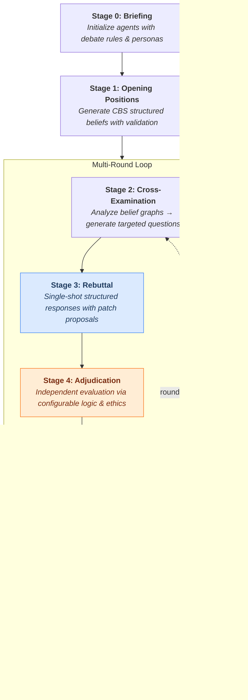

<p align="center">
  
</p>

<h1 align="center">
  CHAL: Council of Hierarchical Agentic Language
</h1>

<p align="center">
  <a href="https://arxiv.org/abs/2605.12718"></a>
  
  
</p>

**CHAL** (pronounced "kal") is a framework for orchestrating structured philosophical debates between multiple LLM agents. Each agent embodies a distinct epistemological position, engaging in multi-stage debates with cross-examination, rebuttals, independent adjudication, and formal belief revision. The system tracks beliefs as dependency graphs with confidence propagation, structural validation, and patch-based updates via the CBS (CHAL Belief Schema). CHAL ships with an interactive CLI wizard, debate history with replay, and comprehensive output generation.

---

## Key Features

- **6-stage debate pipeline** — briefing, opening positions, cross-examination, rebuttal, adjudication, belief update
- **13 epistemic personas** — Empiricist, Rationalist, Skeptic, Bayesian, Phenomenologist, Pragmatist, Constructivist, Nihilist, Supernaturalist, Panpsychist, Simulationist, Synthesist, plus a NONE option for custom beliefs
- **Formal belief tracking (CBS)** — dependency graphs, strength propagation, structural validation, patch-based updates. See the [CBS Schema Reference](docs/CBS_reference.md)
- **8 logic systems + 6 ethics frameworks** for configurable adjudication
- **6 LLM providers** — OpenAI, Anthropic, Google, Ollama, xAI, Perplexity
- **Interactive CLI wizard** with preset system and debate history
- **Belief trajectory visualization** — UMAP/PCA embedding plots and convergence analysis
- **Parallel execution** with thread-safe key rotation
- **Comprehensive test suite** — 1890 tests, all mocked (zero API cost)

---

## How It Works

### 6-Stage Debate Pipeline



---

## Installation

**Requirements:** Python 3.10+, Git, and [Poetry](https://python-poetry.org/)

```bash
# 1. Clone repository
git clone https://github.com/GdKent/CHAL.git
cd CHAL

# 2. Install Poetry (if not already installed)
curl -sSL https://install.python-poetry.org | python3 -

# 3. Install dependencies
poetry install

# 4. Configure API keys
cp env.example .env
# Edit .env and add your OPENAI_API_KEY (required for default configs)

# 5. Verify installation
poetry run python -c "import chal; print('CHAL installation successful!')"
```

> **Anaconda users:** Create environment with `conda create -n chal_env python=3.10`, activate it, then `pip install poetry==2.1.3` before running `poetry install`.

---

## Quick Start

### Interactive CLI (Recommended)

```bash
chal
```

The wizard walks you through topic selection, agent setup, adjudicator settings, output toggles, and parallelization — then presents a review panel where you can edit, save, or launch.

### Headless Mode

```bash
chal --config default              # Built-in preset
chal --config path/to/my_config.yaml  # Custom file
chal --config default --edit       # Load preset into wizard for editing
chal --config default -v           # Verbose output
```

### Debate History

```bash
chal --history           # View past debates
chal --replay a1b2c3d4   # Replay a past debate by ID
```

---

## CLI Reference

| Command | Description |
|---------|-------------|
| `chal` | Launch interactive wizard |
| `chal -c <name\|path>` | Run with named preset or YAML file (headless) |
| `chal -c <name> --edit` | Load config into wizard for editing |
| `chal --history` | Display past debate history |
| `chal --replay <id>` | Re-run a past debate by its 8-character ID |
| `chal -v` | Enable verbose output |

---

## Configuration

Minimal example — see the [full configuration reference](docs/documentation.md#16-configuration-system) for all options.

```yaml
debate:
  topic: "Does free will exist?"
  max_rounds: 1

agents:
  - name: "Agent-Empiricist"
    persona: "EMPIRICIST"
    model: "o4-mini"
    provider: "openai"
    temperature: 0.7

  - name: "Agent-Supernaturalist"
    persona: "SUPERNATURALIST"
    model: "o4-mini"
    provider: "openai"
    temperature: 0.7

adjudication:
  model: "o4-mini"
  provider: "openai"
  logic_weight: 1.0
  ethics_weight: 0.0
  logic_system: "CLASSICAL_INFORMAL_BAYESIAN"
  ethics_system: "NONE"

outputs:
  storage_dir: "src/chal/storage"
  save_transcript: true
```

### Multi-Provider Support

| Provider | Key Models | Environment Variable |
|----------|-----------|---------------------|
| `openai` | `gpt-4o`, `o4-mini`, `o3-mini` | `OPENAI_API_KEY` |
| `anthropic` | `claude-opus-4-6`, `claude-sonnet-4-5-20250929` | `ANTHROPIC_API_KEY` |
| `google` | `gemini-2.0-flash`, `gemini-2.0-pro` | `GOOGLE_API_KEY` |
| `ollama` | Any local model (e.g., `deepseek-r1:14b`) | *(none — local)* |
| `xai` | Grok models | `XAI_API_KEY` |
| `perplexity` | Perplexity models | `PERPLEXITY_API_KEY` |

Multiple API keys per provider are supported (comma-separated in `.env`) for parallel execution with thread-safe key rotation.

---

## Testing

All tests use mocking — no API keys required and zero cost.

```bash
python run_tests.py          # Cross-platform test runner
poetry run pytest            # Direct
poetry run pytest -m unit    # Unit tests only
```

See the [test suite documentation](docs/documentation.md#23-test-suite) for coverage details and test structure.

---

## Documentation

| Document | Description |
|----------|-------------|
| [Full Technical Documentation](docs/documentation.md) | Complete codebase reference — architecture, pipeline stages, agent system, configuration, CLI, utilities, and more |
| [CBS Schema Reference](docs/CBS_reference.md) | Detailed specification of the CHAL Belief Schema — node types, dependency rules, strength propagation, and validation |

---

## Contributing

We welcome contributions, suggestions, and critiques.

To get started:
1. Fork this repository
2. Create a new branch
3. Make your changes
4. Submit a pull request

---

## License

MIT — see [LICENSE](LICENSE).

---

## Citation

If you use CHAL in your research, click **"Cite this repository"** on the GitHub sidebar, or see [CITATION.cff](CITATION.cff).

---

## Contact

[g.hal.dkent@gmail.com](mailto:g.hal.dkent@gmail.com) · [GitHub](https://github.com/GdKent) · [Issues](https://github.com/GdKent/CHAL/issues)

---

<p align="center">
  <i>Advancing truth through structured dialectics</i>
</p>
