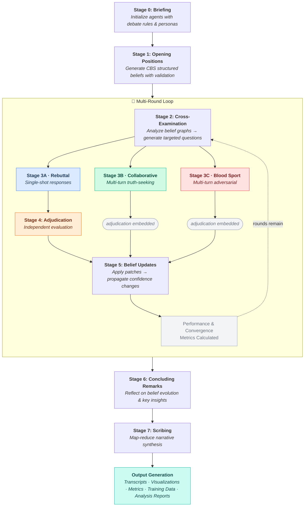

<p align="center">
  
</p>

<h1 align="center">
  CHAL: Council of Hierarchical Agentic Language
</h1>

**CHAL** (pronounced "kal") is a framework for orchestrating structured philosophical debates between multiple LLM agents. Each agent embodies a distinct epistemological position, engaging in multi-stage debates with cross-examination, configurable argumentation modes (single-shot rebuttals, collaborative truth-seeking, or adversarial blood sport), independent adjudication, and synthesis. The system tracks formal belief structures with dependency graphs, confidence scores, and convergence metrics.

---

## Table of Contents

- [Overview](#overview)
- [Installation](#installation)
- [Quick Start](#quick-start)
- [Testing](#testing)
- [How It Works](#how-it-works)
- [Debate Modes](#debate-modes)
- [Configuration](#configuration)
- [Outputs](#outputs)
- [Project Structure](#project-structure)
- [Contributing](#contributing)
- [License](#license)

---

## Overview

CHAL implements a rigorous multi-agent debate framework that orchestrates structured dialectical exchanges between large language model agents representing distinct epistemological positions. The system executes an eight-stage debate pipeline encompassing briefing, opening position formulation, cross-examination, rebuttal generation, independent adjudication, belief revision, concluding remarks, and narrative synthesis. This architecture enables systematic exploration of philosophical questions through adversarial argumentation, where agents must defend their positions against targeted critique while updating their beliefs in response to valid challenges.

At the core of CHAL lies the CBS-v1 (CHAL Belief Schema), a formal JSON-based representation system that structures agent reasoning into interdependent components: thesis statements, propositional claims, foundational assumptions, empirical evidence, testable predictions, and normative implications. Each belief element maintains confidence scores and explicit dependency relationships, forming directed acyclic graphs that enable structural validation. The system automatically detects logical inconsistencies such as orphaned claims lacking evidentiary support, circular dependencies among propositions, and violations of confidence coherence constraints. This formal representation makes agent reasoning transparent, inspectable, and amenable to quantitative analysis.

The adjudication mechanism employs an independent neutral agent that evaluates challenge-rebuttal exchanges using configurable logic and ethics frameworks. The adjudicator restates disagreements in neutral terms, formalizes arguments into logical structures, applies weighted evaluation criteria encompassing deductive validity and inductive support, and renders binding outcomes that determine whether challenges succeed or defenses prevail. This adversarial-dialectical process surfaces hidden assumptions, exposes evidential gaps, and forces agents to strengthen their reasoning or revise untenable positions. Performance metrics track successful critiques and rebuttals across debate rounds, while convergence analysis measures semantic similarity between agent beliefs using embedding-based techniques and UMAP dimensionality reduction.

CHAL serves multiple research communities with distinct methodological needs. AI safety researchers employ the framework to study multi-agent alignment, belief propagation dynamics, and emergent collective reasoning behaviors in systems with heterogeneous epistemological commitments. Computational philosophers utilize CHAL to formalize classical arguments, test counterfactual variations at scale, and explore how different philosophical frameworks address identical questions. The system provides prompt engineers with architectural patterns for building complex agentic systems that maintain formal belief structures and update them systematically in response to evidence. Educators leverage CHAL's transparent reasoning processes to demonstrate critical thinking, argumentation theory, and the dialectical method through concrete, reproducible examples. The framework includes twelve pre-built philosophical personas spanning empiricism, rationalism, skepticism, Bayesian probabilism, phenomenology, pragmatism, constructivism, nihilism, supernaturalism, panpsychism, simulationism, and synthetic perspectivalism, with extensible support for domain-specific custom personas.

---

## Installation

**Requirements:** Python 3.10+, Git, and [Poetry](https://python-poetry.org/)

```bash
# 1. Clone repository
git clone https://github.com/GdKent/CHAL.git
cd CHAL

# 2. Install Poetry (if not already installed)
curl -sSL https://install.python-poetry.org | python3 -

# 3. Install dependencies
poetry install

# 4. Configure API keys
cp .env.example .env
# Edit .env and add your OPENAI_API_KEY (required for default configs)

# 5. Verify installation
poetry run python -c "import chal; print('CHAL installation successful!')"
```

> **Anaconda users:** Create environment with `conda create -n chal_env python=3.10`, activate it, then `pip install poetry==2.1.3` before running `poetry install`.

---

## Quick Start

Run a debate using the default configuration:

```bash
poetry run python run_debate.py
```

This runs a 1-round debate on "Does free will exist?" between Empiricist and Supernaturalist agents, generating transcripts, visualizations, and analysis.

**Using different configurations:**
```bash
# Pre-configured scenarios
poetry run python run_debate.py --config default              # Standard rebuttal mode
poetry run python run_debate.py --config quick_test            # Fast single-round test
poetry run python run_debate.py --config collaborative         # Collaborative truth-seeking
poetry run python run_debate.py --config bloodsport_example    # Adversarial blood sport

# Custom configuration
poetry run python run_debate.py --config path/to/my_config.yaml

# With verbose logging
poetry run python run_debate.py -c default -v
```

**Create custom configs** in `src/chal/configurations/`:
```yaml
debate:
  topic: "Your question here"
  max_rounds: 2

agents:
  - name: "Agent-1"
    persona: "EMPIRICIST"  # See Agent Personas below
    model: "gpt-4o"
    temperature: 0.7

adjudication:
  model: "o1-mini"  # Recommended for reasoning
  logic_weight: 1.0
  ethics_weight: 0.0
```

---

## How It Works

### 8-Stage Debate Pipeline



**Stage 0: Briefing.** The system initializes each agent with universal debate rules governing logical reasoning and argumentation norms, applies persona-specific prompts that encode distinct epistemological frameworks, and establishes the central topic for dialectical examination.

**Stage 1: Opening Positions.** Agents generate initial belief structures conforming to the CBS-v1 schema, articulating their thesis statements alongside supporting claims, foundational assumptions, and empirical evidence. The system validates each belief graph for structural integrity, rejecting malformed beliefs containing orphaned claims (assertions lacking evidentiary support) or circular dependencies (propositions that depend on themselves through transitive relationships). Agents receive up to three opportunities to revise invalid beliefs before proceeding.

**Stages 2-5: Multi-Round Dialectical Exchange.** The core debate loop iterates for a configurable number of rounds, with each cycle consisting of several interdependent stages. In **Stage 2: Cross-Examination**, agents analyze opponent belief graphs to identify structural and epistemic vulnerabilities, including orphaned claims, circular reasoning patterns, weak confidence propagation chains, and unsupported foundational assumptions. Each agent generates up to five targeted questions per opponent, employing anti-repetition mechanisms that track previous challenges across rounds to prevent redundant questioning.

**Stage 3** is the central argumentative exchange and supports three distinct modes selected via the `stage3_mode` configuration parameter (see [Debate Modes](#debate-modes)). In **rebuttal** mode (the default), agents receiving challenges provide single-shot structured responses indicating whether they defend their original position, concede the critique, or clarify potential misunderstandings. In **collaborative** mode, agents engage in multi-turn truth-seeking dialogue where pairs exchange arguments iteratively until reaching consensus, exhausting turn limits, or triggering early termination on agreement. In **blood sport** mode, agents engage in multi-turn adversarial rhetorical combat with configurable intensity levels, where the objective shifts from truth-seeking to winning through rhetorical force. Both collaborative and blood sport modes embed adjudication within the exchange itself, while rebuttal mode proceeds to a separate **Stage 4: Adjudication**.

The **Stage 4: Adjudication** process (used in rebuttal mode, or embedded inline in collaborative and blood sport modes) employs an independent neutral agent to evaluate each challenge-rebuttal pair. The adjudicator first restates the core disagreement in neutral terms, then formalizes both the challenge and rebuttal into logical structures mapping to specific belief graph elements. Evaluation proceeds using weighted criteria combining logical validity (assessing deductive soundness, inductive support, absence of contradictions, and consistency with evidence) and optional ethical coherence. The adjudicator renders one of three outcomes: `rebuttal_valid` indicates successful defense, `critique_valid` indicates a legitimate challenge requiring belief revision, and `unresolved` indicates insufficient clarity for definitive judgment. In **Stage 5: Belief Updates**, agents revise their belief structures based on adjudication outcomes. When `critique_valid` is rendered against an agent, that agent must generate belief patches addressing the identified flaw—this requirement is systemically enforced to ensure dialectical accountability. Confidence adjustments propagate automatically through belief graph dependencies, maintaining Bayesian coherence constraints. After each round, the system calculates performance metrics and convergence scores before proceeding to the next iteration or concluding the debate.

**Stage 6: Concluding Remarks.** Upon completing all debate rounds, agents reflect on the evolution of their positions by comparing initial and final belief states, identifying key insights gained through dialectical exchange, acknowledging substantive concessions made, and assessing overall confidence trajectories. Each agent produces a concise summary capturing their ultimate stance.

**Stage 7: Scribing.** A dedicated scribe agent employs a map-reduce architecture to generate a cohesive narrative synthesis of the complete debate. The map phase processes the full transcript in overlapping 15,000-character chunks, extracting key argumentative developments and maintaining continuity state across segments. The reduce phase integrates these narrative slices into expository prose employing formal, research-paper tone with clear sectioning and transitions.

### CBS Belief Schema

Formal JSON structure for tracking agent beliefs:

```json
{
  "schema_version": "CBS-v1",
  "thesis": {
    "stance": "Core position",
    "summary_bullets": ["Key point 1", "Key point 2"],
    "confidence": 0.75
  },
  "claims": [
    {
      "id": "C1",
      "statement": "Specific proposition",
      "depends_on": ["A1", "E1"],
      "confidence": 0.8
    }
  ],
  "assumptions": [{"id": "A1", "statement": "Foundational premise"}],
  "evidence": [{"id": "E1", "type": "empirical", "summary": "Supporting data"}],
  "predictions": [{"id": "P1", "statement": "Testable prediction"}],
  "normative_implications": [{"id": "N1", "statement": "Ethical consequence"}]
}
```

The schema implements comprehensive dependency tracking whereby propositional claims explicitly reference their supporting assumptions and evidence through unique identifiers, forming directed acyclic graphs amenable to graph-theoretic analysis. Confidence scores attached to each element undergo Bayesian propagation such that dependent claims cannot maintain confidence levels exceeding their weakest supporting elements, ensuring epistemic coherence. The validation system performs structural integrity checks detecting orphaned claims, circular dependencies, and broken references before accepting belief updates. The patchable architecture enables incremental belief revisions without requiring complete belief reconstruction, supporting efficient iterative refinement during multi-round debates.

### Agent Personas

| Persona | Epistemology |
|---------|--------------|
| EMPIRICIST | Knowledge from observation & experiment |
| RATIONALIST | Knowledge from reason & deduction |
| SKEPTIC | No certain knowledge possible |
| BAYESIAN | Probabilistic inference |
| PHENOMENOLOGIST | Truth grounded in lived experience |
| PRAGMATIST | Truth is what works in practice |
| CONSTRUCTIVIST | Knowledge is socially constructed |
| NIHILIST | No inherent meaning or truth |
| SUPERNATURALIST | Truth beyond empirical realm |
| PANPSYCHIST | Consciousness is fundamental |
| SIMULATIONIST | Reality may be simulated |
| SYNTHESIST | Multi-perspectival integration |

Create custom personas in `src/chal/agents/prompts.py`.

---

## Debate Modes

CHAL supports three distinct Stage 3 debate modes, each producing different argumentative dynamics while sharing the same cross-examination, belief update, and synthesis infrastructure. The mode is selected via the `stage3_mode` parameter in the debate configuration.

### Rebuttal Mode (Default)

Rebuttal mode implements the classical single-shot dialectical exchange. After cross-examination, each challenged agent produces one structured response per question, indicating whether it defends, concedes, or clarifies. These challenge-rebuttal pairs then proceed to Stage 4 for independent adjudication. This mode provides clean, deterministic exchanges well-suited to formal argumentation analysis and represents the simplest computational path through the pipeline.

```yaml
debate:
  stage3_mode: "rebuttal"
```

### Collaborative Mode

Collaborative mode replaces single-shot rebuttals with multi-turn truth-seeking dialogue. Agent pairs exchange arguments iteratively on each challenge, with an adjudicator periodically checking whether the exchange has reached resolution. Dialogue continues until the agents reach agreement, the adjudicator determines a clear outcome, or the configured turn limit is exhausted. This mode produces richer dialectical transcripts and enables study of how agents negotiate meaning and converge toward shared understanding. Because adjudication is embedded within the exchange, Stage 4 is skipped when collaborative mode is active.

```yaml
debate:
  stage3_mode: "collaborative"

collaborative:
  max_turns_per_question: 10    # Maximum back-and-forth turns per challenge
  min_turns_per_question: 3     # Minimum turns before early termination
  adjudicator_check_interval: 2 # Adjudicator evaluates every N turns
  early_termination_on_agreement: true
```

### Blood Sport Mode

Blood sport mode replaces truth-seeking with adversarial rhetorical combat. Agents are instructed to win arguments through rhetorical force rather than pursue collaborative understanding. The standard adjudicator evaluates exchanges unchanged, providing a natural testbed for studying adjudicator robustness against manipulative argumentation tactics such as emotional appeals, rhetorical misdirection, and selective evidence presentation. The intensity parameter controls how aggressively agents argue, ranging from firm disagreement without charitable interpretation (`mild`) through full rhetorical combat with emotional appeals (`moderate`) to unrestricted rhetorical warfare (`extreme`). As with collaborative mode, adjudication is embedded within the exchange and Stage 4 is skipped.

This mode serves several research objectives. It tests whether the adjudicator can reliably identify valid arguments amid adversarial noise without specialized forensic prompting. It generates training data pairing manipulative argumentation with adjudicator evaluations, useful for fine-tuning models on argument quality assessment. It also enables study of how agents update beliefs when subjected to adversarial pressure — the belief update stage includes adversarial resilience instructions that direct agents to distinguish between rhetorically compelling but logically unsound arguments and genuinely valid critiques.

```yaml
debate:
  stage3_mode: "bloodsport"

bloodsport:
  intensity: "moderate"  # "mild" | "moderate" | "extreme"
  max_exchanges: 5       # Back-and-forth turns per agent pair
```

---

## Configuration

### Basic Configuration Structure

```yaml
metadata:
  name: "Debate Name"
  description: "Description"

debate:
  topic: "Central question"
  max_rounds: 2
  stage3_mode: "rebuttal"  # "rebuttal" | "collaborative" | "bloodsport"

agents:
  - name: "Agent-Name"
    persona: "PERSONA_CONSTANT"
    model: "gpt-4o"
    temperature: 0.7

adjudication:
  model: "o1-mini"  # Best for reasoning
  logic_weight: 1.0
  ethics_weight: 0.0

outputs:
  storage_dir: "src/chal/storage"
  save_synthesis: true
  save_transcript: true
  generate_embeddings: true
  plot_trajectories: true

  # Analysis & training data export (optional, works with all modes)
  save_analysis_report: false
  analysis_report_file: "debate_analysis_report.md"
  save_training_data: false
  training_data_file: "debate_training_data.jsonl"
  belief_pairs_file: "debate_belief_pairs.jsonl"
```

### Model Selection and Hyperparameters

Model selection significantly impacts debate quality and computational cost. For agent roles, OpenAI's `gpt-4o` provides the recommended balance of reasoning capability, response quality, and cost-effectiveness. For adjudication tasks requiring rigorous logical evaluation, the `o1-mini` model demonstrates superior performance due to its reasoning-optimized architecture, while `o1` offers maximum analytical rigor at increased latency and cost. Temperature settings should be calibrated to task requirements: values between 0.0 and 0.3 produce focused, deterministic outputs suitable for structured JSON generation and formal reasoning, whereas values between 0.7 and 0.9 enable creative, diverse responses appropriate for agent personas engaging in exploratory argumentation.

---

## Outputs

CHAL generates comprehensive output artifacts spanning narrative documentation, quantitative analysis, and debugging information, all saved to the `src/chal/storage/` directory.

### Narrative Documentation

The system produces four primary narrative outputs capturing different temporal phases of the debate. The `debate_synthesis.txt` file contains a flowing expository narrative generated by the Stage 7 scribe agent, presenting the complete dialectical exchange in research-paper style prose with coherent transitions and thematic organization. The `debate_transcript.txt` file provides a chronological markdown-formatted record of all eight stages, preserving the complete sequence of opening positions, cross-examination questions, rebuttals, adjudication outcomes, belief updates, and concluding remarks. To facilitate longitudinal analysis, the system saves `initial_beliefs.txt` containing agent positions before any dialectical engagement, and `final_beliefs.txt` documenting final belief states after all updates have been applied, both rendered in human-readable markdown from the CBS-v1 JSON structures.

### Quantitative Analysis

The framework generates multiple analysis artifacts enabling empirical study of belief dynamics and agent performance. The `embeddings.npz` file stores compressed NumPy arrays containing semantic embeddings of agent beliefs at each debate round, computed using sentence-transformer models (all-mpnet-base-v2) and suitable for trajectory analysis and convergence measurement. The `belief_trajectories.png` visualization employs UMAP dimensionality reduction to project high-dimensional belief embeddings into two-dimensional space, with points representing agent beliefs at specific rounds, directed arrows indicating temporal evolution, and spatial proximity reflecting semantic similarity. Convergence manifests as agents moving closer together in embedding space, while divergence appears as increasing separation. When enabled, the optional `belief_graph.html` file provides an interactive Cytoscape.js visualization of belief dependency structures, allowing exploration of claims, assumptions, evidence, and their interconnections. The `agent_stats.json` file records comprehensive performance metrics including win-loss records, raw and normalized scores, and argument-level outcomes. The scoring system awards 3.0 points per successful critique, 2.0 points per successful rebuttal, imposes -2.0 point penalties for failed rebuttals, and assigns -0.5 points for unresolved exchanges, enabling quantitative assessment of argumentative effectiveness.

### Analysis Reports and Training Data

CHAL includes mode-agnostic output features for post-debate analysis and training data export, enabled via the `save_analysis_report` and `save_training_data` configuration flags. These features work identically across all three debate modes.

When `save_analysis_report` is enabled, the system generates a `debate_analysis_report.md` file containing a structured Markdown report summarizing the complete debate. The report includes debate metadata (topic, mode, round count, agent configurations), verdict distribution statistics across all challenge-rebuttal exchanges, per-agent performance summaries with scores and argument outcomes, belief evolution trajectories showing how each agent's position changed across rounds, and mode-specific sections such as blood sport intensity settings or collaborative turn limits. A corresponding JSON representation is also available programmatically via the `generate_analysis_json()` function for integration with downstream analysis pipelines.

When `save_training_data` is enabled, the system records structured debate events throughout the pipeline using a passive `DebateRecorder` that observes each stage without affecting debate logic. The recorder captures belief formations, cross-examinations, rebuttals or adversarial exchanges, adjudication outcomes, and belief updates with full context including model identifiers, round numbers, and raw belief objects. This data is exported in two complementary formats. The `debate_training_data.jsonl` file contains the complete debate record as a JSONL timeline with metadata, suitable for training data curation or replay analysis. The `debate_belief_pairs.jsonl` file contains extracted input-target pairs mapping debate contexts to belief outputs — formation pairs (topic and persona mapped to initial belief) and update pairs (prior belief, adjudication results, and debate context mapped to revised belief) — structured for supervised fine-tuning of language models on structured reasoning tasks.

### Debugging and Diagnostics

The `log.txt` file provides exhaustive debugging information including all prompts submitted to language models, complete raw responses, JSON parsing success and failure reports, belief validation outcomes with specific error descriptions, and stage-by-stage execution traces with timestamps. This comprehensive logging supports reproducibility, error diagnosis, and system refinement.

---

## Project Structure

```
CHAL/
├── src/chal/
│   ├── agents/                 # Agent implementations & personas
│   ├── beliefs/                # CBS-v1 schema, graph validation, patches
│   ├── orchestrator/           # DebateController & Adjudicator
│   ├── embeddings/             # Belief trajectory tracking
│   ├── convergence/            # Convergence metrics
│   ├── configurations/         # YAML debate configs (default, collaborative,
│   │                           #   bloodsport_example, quick_test)
│   ├── utilities/              # CLI, reporting, training data export
│   └── storage/                # Generated outputs (debates, logs)
├── tests/
│   ├── fixtures/               # Test data and mock responses
│   ├── integration/            # Cross-module integration tests
│   ├── e2e/                    # End-to-end workflow tests
│   ├── test_bloodsport/        # Blood sport mode tests
│   ├── test_*.py               # Unit tests (by module)
│   ├── utils.py                # Testing utilities and helpers
│   └── conftest.py             # Pytest configuration and shared fixtures
├── run_debate.py               # Main CLI entry point
├── run_tests.py                # Test runner script
├── pyproject.toml              # Poetry dependencies & config
├── poetry.lock                 # Locked dependency versions
├── .env                        # API keys (not in repo)
└── .gitignore                  # Git ignore rules
```

The architecture centers on four primary components. The [DebateController](src/chal/orchestrator/debate_controller.py) orchestrates the complete eight-stage dialectical pipeline, managing agent interactions, message histories, and belief evolution tracking. The [BeliefGraph](src/chal/beliefs/belief_graph.py) class implements directed acyclic graph structures with comprehensive validation routines for structural integrity checking. The [Adjudicator](src/chal/orchestrator/adjudicator.py) provides independent neutral evaluation of challenge-rebuttal pairs using configurable logical and ethical criteria. The [OpenAIAgent](src/chal/agents/openai_agent.py) implements the concrete agent interface with retry logic, temperature control, and belief state management, extensible to alternative LLM providers.

---

## Advanced Usage

### Multi-Round Debates

Extended multi-round debates enable deeper dialectical exploration by allowing agents to refine their arguments iteratively in response to sustained critique. Configuring `max_rounds` to values greater than one (e.g., three complete debate cycles) permits agents to strengthen weak positions identified in early rounds, incorporate insights from opponent arguments, and progressively converge toward or diverge from competing viewpoints. The anti-repetition mechanisms ensure that subsequent rounds introduce novel challenges rather than rehashing previously addressed objections. Convergence metrics calculated after each round provide quantitative evidence of belief evolution trajectories. However, computational cost scales linearly with round count, as each cycle requires complete execution of Stages 2-5, including cross-examination generation, rebuttal formulation, adjudication evaluation, and belief revision.

### Custom Personas

Edit [src/chal/agents/prompts.py](src/chal/agents/prompts.py):

```python
MY_CUSTOM_PERSONA = """You are a [position]. You believe that [core tenets].
You [methodology]."""
```

Then reference in config:
```yaml
agents:
  - persona: "MY_CUSTOM_PERSONA"
```

### Tuning Adjudication

**Pure Logic Mode:**
```yaml
adjudication:
  logic_weight: 1.0
  ethics_weight: 0.0
```

**Ethics-Weighted Mode:**
```yaml
adjudication:
  logic_weight: 0.6
  ethics_weight: 0.4
  ethics_system: "Rule utilitarianism with deontological constraints"
```

---

## Testing

CHAL includes a comprehensive test suite with 543 tests covering core functionality, edge cases, and integration scenarios. All tests use mocking to avoid API charges, meaning you can run the full test suite without an OpenAI API key and without incurring any costs.

### Running Tests

**Quick Start:**

```bash
# Cross-platform test runner (recommended)
python run_tests.py

# Or use platform-specific scripts
./run_tests.sh          # Linux/Mac
run_tests.bat           # Windows

# Or use poetry directly
poetry run pytest
```

**Test Categories:**

```bash
# Unit tests only (483 tests, <1 minute)
poetry run pytest -m unit

# Integration tests (45 tests, <30 seconds)
poetry run pytest -m integration

# End-to-end tests (5 tests, <20 seconds)
poetry run pytest -m e2e

# Test specific module
poetry run pytest tests/test_belief_graph.py

# Test specific function
poetry run pytest tests/test_belief_graph.py::test_has_cycle_false_acyclic
```

**Coverage Report:**

```bash
# Generate HTML coverage report
poetry run pytest --cov=src/chal --cov-report=html

# View report
open htmlcov/index.html     # Mac
xdg-open htmlcov/index.html # Linux
start htmlcov/index.html    # Windows
```

### Test Structure

```
tests/
├── fixtures/               # Test data and mock responses
├── integration/            # Cross-module integration tests
├── e2e/                    # End-to-end workflow tests
├── test_bloodsport/        # Blood sport mode tests (config, prompts, integration)
├── test_*.py               # Unit tests (by module)
├── utils.py                # Testing utilities and helpers
└── conftest.py             # Pytest configuration and shared fixtures
```

**Key Features:**
- **Zero API Costs:** All LLM calls are mocked—no API keys required for testing
- **Fast Execution:** Full test suite completes in <2 minutes
- **543 Tests:** Comprehensive coverage of core modules, with 483 unit tests
- **Well-Tested Core:** >85% coverage on critical modules (belief_graph, patches, prompts, agents)

---

## Contributing

The CHAL project welcomes contributions from researchers and developers interested in advancing multi-agent reasoning systems. To contribute, fork the repository and create a feature branch using descriptive naming conventions (e.g., `feature/bayesian-update-mechanism`). Implement your modifications with clear, atomic commit messages that document the rationale and scope of each change. When applicable, validate your contributions by running the test suite via `poetry run pytest`. Submit a pull request with a comprehensive description of the changes, their motivation, and any relevant issue references.

Valuable contribution areas include novel agent personas encoding additional epistemological frameworks, integrations with alternative LLM providers (Anthropic, Google, Cohere), enhanced visualization techniques for belief dynamics, performance optimizations for large-scale debates, documentation improvements clarifying theoretical foundations or implementation details, and bug fixes addressing identified issues. All code contributions should adhere to PEP 8 style guidelines, include comprehensive docstrings for public interfaces, and employ type hints to enhance code clarity and enable static analysis.

---

## License

This project is licensed under the MIT License, the full text of which is available in the [LICENSE](LICENSE) file. The MIT License permits unrestricted use, modification, and distribution of the software for both academic and commercial purposes, subject to inclusion of the original copyright notice and license terms in derivative works. The software is provided without warranty of any kind, express or implied, including but not limited to warranties of merchantability, fitness for particular purpose, or non-infringement.

---

## Contact

For correspondence regarding the framework, contact [g.hal.dkent@gmail.com](mailto:g.hal.dkent@gmail.com). The project repository is maintained at [https://github.com/GdKent/CHAL](https://github.com/GdKent/CHAL), and the author's GitHub profile is available at [https://github.com/GdKent](https://github.com/GdKent). Bug reports, feature requests, and technical issues should be submitted through the [GitHub Issues](https://github.com/GdKent/CHAL/issues) interface, which serves as the primary support channel for the project.

---

**Citation:**

If you use CHAL in your research, please cite (**TBD**)

---

<p align="center">
  <i>Advancing truth through structured dialectics</i>
</p>
